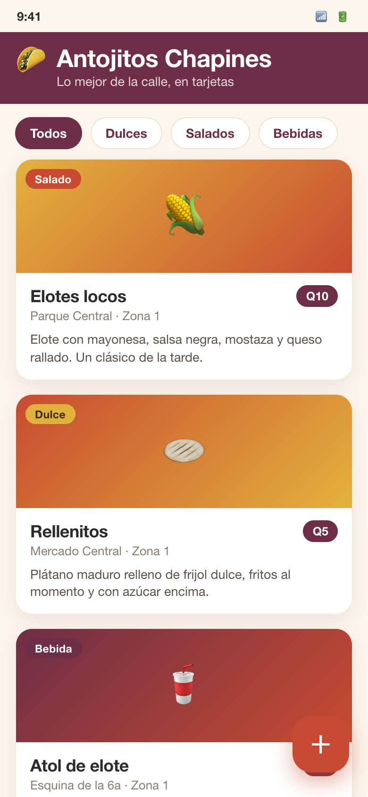
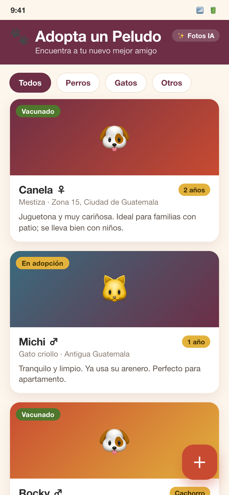
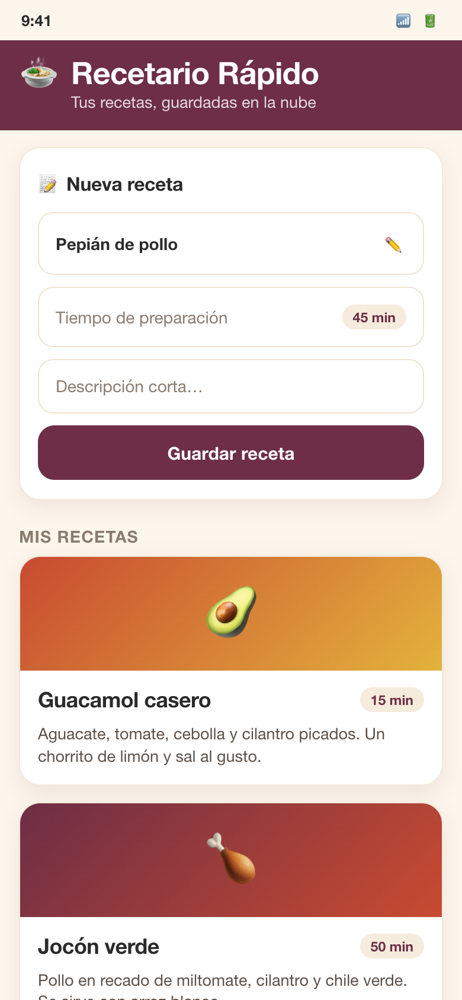
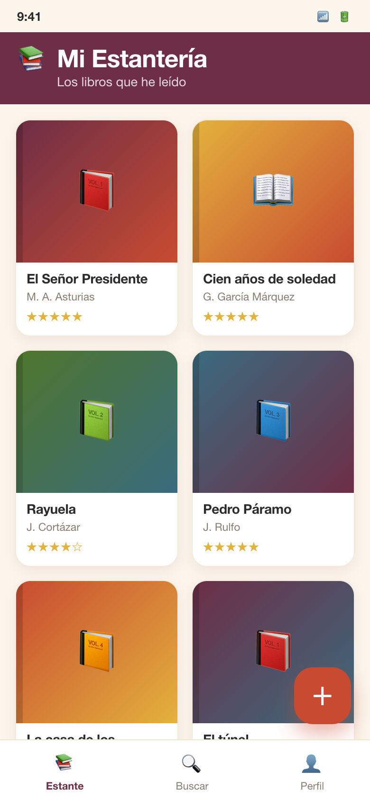
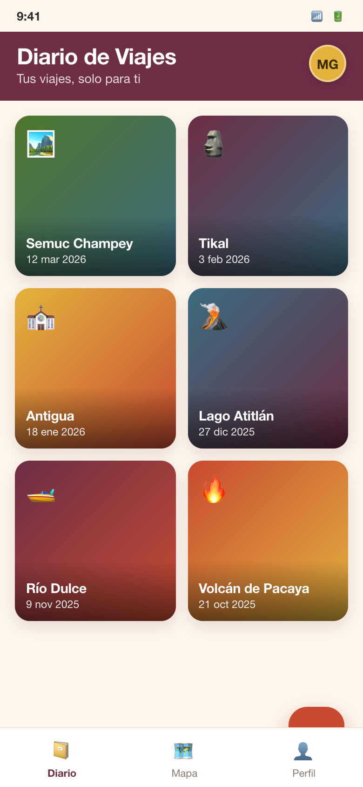
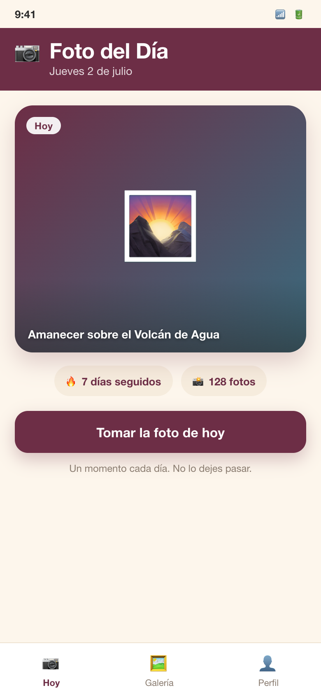

# Demos del docente (para construir en vivo)

Estas son las **mini-apps que el docente construye en vivo** durante las sesiones de contenido, para ilustrar el concepto del día con variedad. **No son material del estudiante** ni se muestran en los slides: viven aquí y en las instrucciones del docente.

Cada carpeta trae un **mock-up HTML** (referencia visual del resultado esperado, paleta vino del curso) y su **captura**. El docente **reconstruye** la app en vivo en Google AI Studio con prompts; estos archivos son solo la meta visual, no se compilan ni se copian tal cual.

> Vista rápida: abre cualquier `*.html` en el navegador (comparten `base.css`). Son pantallas móviles de 390×844.

## Galería

| Sesión | Demo | Concepto que enseña | Archivo | Captura |
|--------|------|---------------------|---------|---------|
| 1 | **Antojitos Chapines** | Prompt inicial detallado + UI de tarjetas (cards) | [antojitos-chapines.html](antojitos-chapines.html) |  |
| 2 | **Adopta un Peludo** | Filtro + vista de detalle; imágenes generadas con Nano Banana | [adopta-un-peludo.html](adopta-un-peludo.html) |  |
| 3 | **Recetario Rápido** | Datos en la nube (Firestore) + formulario; la lista se actualiza sola | [recetario-rapido.html](recetario-rapido.html) |  |
| 4 | **Mi Estantería** | Construir una app **nativa** y verla en el emulador del navegador | [mi-estanteria.html](mi-estanteria.html) |  |
| 6 | **Diario de Viajes** | Login con Google + datos y fotos **privadas por usuario** (uid) | [diario-de-viajes.html](diario-de-viajes.html) |  |
| 7 | **Foto del Día** | La **cámara** como capacidad nativa + pulido de marca (ícono/splash) | [foto-del-dia.html](foto-del-dia.html) |  |

## Cómo se generaron las capturas

Los mock-ups son HTML autocontenidos que comparten `base.css` (el sistema de diseño con la paleta vino). Las capturas se producen con Chrome headless (Playwright) a 390×844. El mismo enfoque se usó para las capturas de las apps de referencia (`proyectos-referencia/*/screenshots/`) y para las que aparecen en los slides (`slides/assets/`).

> El detalle de qué resaltar en cada demo está en `instrucciones-docente/sesion-XX.md` (bloque **Demo del docente**).
