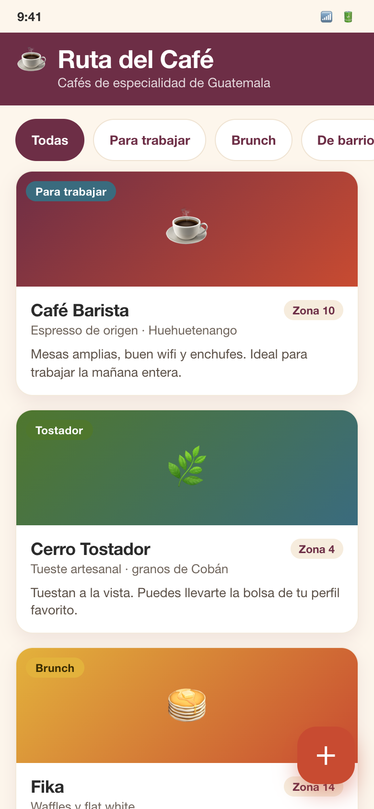
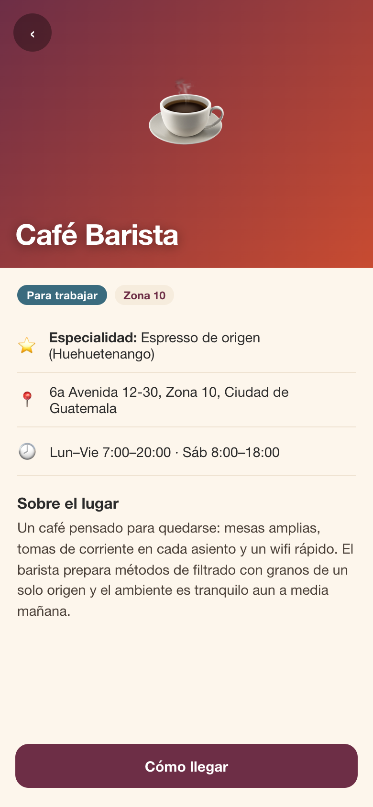
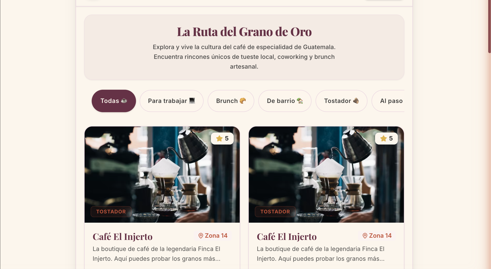
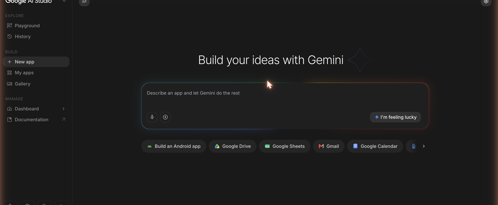
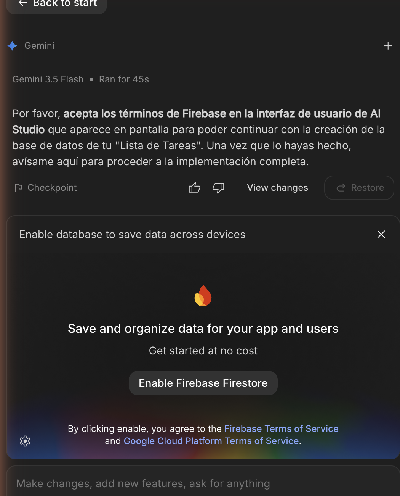

# Proyecto 1 (PWA): Ruta del Café

## Objetivo

Al finalizar esta guía habrás construido **"Ruta del Café"**, una guía de **cafés de especialidad en Guatemala** que funciona como **PWA** (una app web instalable en el teléfono). La construyes en **Google AI Studio Build mode**, dirigiendo a la IA con prompts en español, sin escribir código.

Esta guía cubre el contenido de las **semanas 1 a 3** y prepara el **Examen Parcial (semana 5)**. Vas a:

- Diseñar una interfaz con **excelente UI/UX**: tarjetas (cards), filtro por categoría y vista de detalle.
- Darle una **identidad visual** propia y aprender a **personalizarla**.
- Conectar datos reales en la nube con **Firebase Firestore**.
- Hacer la app **instalable como PWA** en tu teléfono.

Al final, en la sección **"Tu proyecto"**, aplicas todo esto a **tu propia idea de app**, que es lo que entregas y se evalúa.

> **Cómo están escritos los prompts de esta guía.** Cada prompt separa la **Funcionalidad (qué hace)** de la **Interfaz (UI/UX — cómo se ve y se siente)**. Esto te enseña a dirigir a la IA con criterio de diseño: primero defines el comportamiento, luego el aspecto, y puedes cambiar uno sin romper el otro.

---

## Antes de empezar (primera clase)

Esta primera parte es de lectura, no de laboratorio. Son tres ideas cortas que te dan contexto antes de escribir tu primer prompt. Léelas con calma: entenderlas hace que todo lo demás tenga sentido.

### 1. GitHub, en una servilleta

**GitHub** es un lugar en internet para **guardar y compartir archivos de un proyecto**, con una particularidad: guarda también su **historial** (cada versión, quién cambió qué y cuándo). A cada proyecto se le llama **repositorio** (o "repo"): imagina una carpeta compartida con memoria.

En este curso lo usamos para dos cosas sencillas: (1) el docente comparte por GitHub **el material y las guías** (como esta), y (2) si quieres, puedes **exportar tu app** desde AI Studio a un repositorio propio para tenerla guardada, versionada y lista para mostrar en tu portafolio. No necesitas dominarlo ni escribir comandos: por ahora basta con saber que un repo es "la carpeta del proyecto, en la nube, con historial".

### 2. Glosario mínimo de IA generativa (lo que sí vas a usar)

No necesitas teoría; solo estas palabras, en lenguaje llano:

| Término | En una línea |
|---------|--------------|
| **Prompt** | La instrucción que le escribes a la IA. Mientras más clara y específica, mejor el resultado. |
| **Modelo** | El "cerebro" de IA que lee tu prompt y produce una respuesta (aquí, el código de tu app). |
| **Gemini (3.5 Flash)** | El modelo de Google que usa AI Studio por defecto. No tienes que configurarlo. |
| **Token** | La unidad en que el modelo "trocea" el texto (pedacitos de palabras). Idea general: prompts y respuestas más largos usan más tokens. |
| **Generar** | Cuando la IA produce algo nuevo a partir de tu prompt (el código, un texto, una imagen). |
| **Iterar / refinar** | Mejorar el resultado con prompts sucesivos, un cambio a la vez, en lugar de pedir todo de golpe. |
| **Checkpoint** | Un punto de guardado al que puedes regresar si un cambio sale mal (un "deshacer" de todo el proyecto). |
| **Alucinación** | Cuando la IA inventa algo con seguridad pero está mal o no existe. Por eso siempre verificas el resultado en la vista previa. |
| **Nano Banana** | El modelo de Google que **genera imágenes** (íconos, ilustraciones) desde un prompt. Vive en el **playground de AI Studio** (una sección aparte, no en Build): generas la imagen ahí y luego la subes a tu app. |
| **Firebase / Firestore** | Los servicios de Google en la nube para tu app. **Firestore** es la base de datos (donde viven, por ejemplo, las cafeterías). AI Studio los configura solo. |

### 3. ¿Cómo hace la IA todo esto?

Cuando escribes un prompt en español —"quiero una guía de cafés con tarjetas y un filtro"—, el modelo (Gemini) **traduce tu intención a código**: escribe los archivos que dibujan la **interfaz** (los colores, las tarjetas, los botones), la **lógica** (qué pasa al tocar un filtro) y la conexión a los **datos** (las cafeterías). Después, AI Studio **ejecuta ese código** y te muestra el resultado funcionando en la **vista previa**, a la derecha. Tú no ves ni tocas el código: ves la app.

Aquí está lo importante para ti como diseñador: **tú eres el director, y la IA es tu desarrollador junior.** La IA teclea rapidísimo y sabe de código, pero **no tiene tu criterio**: no sabe qué se ve bien, qué jerarquía comunica mejor, ni qué se siente propio de tu marca. Eso lo pones tú, con prompts claros y con la separación **Funcionalidad / Interfaz**. Piensa en un director de cine: no opera la cámara ni actúa, pero **toda decisión importante pasa por su visión**. Tu trabajo en este curso es dirigir con buen gusto y criterio; el de la IA, ejecutar.

---

## Prerrequisitos

- Cuenta de Google (Gmail).
- Navegador actualizado (Chrome recomendado).
- Acceso a Google AI Studio: [aistudio.google.com](https://aistudio.google.com).
- No necesitas instalar nada ni saber programar: la IA de AI Studio genera todo el código por ti.

Si aún no configuraste tu cuenta ni entraste a AI Studio, ve primero a `s0-bienvenida-y-configuracion.md`.

---

## Resultado esperado

Una PWA llamada "Ruta del Café" con:

- Una pantalla principal con **tarjetas** de cafeterías (una por café), cada una con imagen, nombre, zona, especialidad y categoría.
- Un **filtro por categoría** en la parte superior.
- Una **vista de detalle** al tocar una tarjeta, con toda la información del café.
- **Identidad visual propia** y personalizable: colores, tipografía y nombre.
- Datos guardados en **Firestore** (colección `cafeterias`).
- Capacidad de **instalarse en el teléfono** como PWA.

**Esto es lo que vamos a construir** (mock-ups de diseño, la meta):





**Así quedó lo generado por la IA** (una versión real construida con esta guía, con fotos y datos reales):



> *Fíjate en la diferencia: el mock-up es el **plano** (qué queremos), y la captura real es **cómo lo resolvió la IA** a partir de tus prompts. Tu criterio de diseño es lo que acerca uno al otro.*

---

## La colección de datos: `cafeterias`

Toda la app gira alrededor de una colección de Firestore llamada `cafeterias`. Cada café es un documento con estos campos (los nombres van en inglés/identificadores de código):

| Campo | Tipo | Descripción |
|-------|------|-------------|
| `nombre` | texto | Nombre del café (ejemplo: "Café Barista de Barrio") |
| `zona` | texto | Dónde está (ejemplo: "Zona 10, Ciudad de Guatemala") |
| `categoria` | texto | Tipo de experiencia: "Para trabajar", "Brunch", "De barrio", "Tostador", "Al paso" |
| `especialidad` | texto | Bebida o grano insignia (ejemplo: "Filtrado de Huehuetenango") |
| `descripcion` | texto | Descripción del café y su ambiente |
| `imagenUrl` | texto | Dirección de la imagen del café |

> *Tip: el contenido (nombres, descripciones) va en español. Los nombres de los campos (`nombre`, `zona`, etc.) se quedan en inglés porque así los entiende el código. Esto es normal y correcto.*

---

## Paso a paso

### Sección 1 (semana 1): Crear la app y diseñar la interfaz

> ⏱ **Tiempo estimado:** ~50–60 min de laboratorio (después de la demo en clase). La generación inicial toma varios minutos.

**Paso 1.** Abre [aistudio.google.com](https://aistudio.google.com), inicia sesión, entra a **Build** y crea una app nueva. Vas a ver el panel de chat a la izquierda y la vista previa (Live preview) a la derecha.



**Paso 2.** En el panel de chat, pega este **prompt inicial** completo. Es el prompt más importante: establece toda la estructura y el nivel de diseño de la app. Fíjate cómo separa **Funcionalidad** de **Interfaz**:

```
Crea una aplicación web usando React con Tailwind CSS que funcione como una guía de cafés de especialidad de Guatemala llamada "Ruta del Café". Toda la interfaz debe estar en español (Guatemala). Quiero una UI/UX de altísima calidad, mobile-first, con jerarquía visual clara y aire generoso.

**Funcionalidad (qué hace):**
- Muestra una lista de cafeterías en tarjetas. Genera 8 cafeterías de ejemplo directamente en la app (aún no conectamos base de datos). Cada café tiene exactamente estos campos:
  - nombre (texto): el nombre del café.
  - zona (texto): dónde está (ejemplos reales de Guatemala: "Zona 10, Ciudad de Guatemala", "Cuatro Grados Norte", "Antigua Guatemala", "Xela").
  - categoria (texto): una de estas cinco: "Para trabajar", "Brunch", "De barrio", "Tostador", "Al paso".
  - especialidad (texto): bebida o grano insignia (ejemplos: "Filtrado de Huehuetenango", "Grano de cooperativa maya de Atitlán (Sololá)", "Tueste de Cobán, Alta Verapaz").
  - descripcion (texto): 1 o 2 frases sobre el ambiente del café.
  - imagenUrl (texto): usa imágenes de placeholder por ahora.
- Que las cafeterías sean variadas: distintas categorías, zonas y especialidades. Incluye la diversidad cafetalera de Guatemala: al menos 1 o 2 cafés que resalten granos de **cooperativas mayas** (por ejemplo, Atitlán/Sololá, Cobán/Alta Verapaz, San Marcos o Huehuetenango) y, si cabe natural, una mención a la **costa caribeña (cultura garífuna)**. Con respeto y sin estereotipos.

**Interfaz (UI/UX — cómo se ve y se siente):**
- Layout y jerarquía: un encabezado (header) con el nombre "Ruta del Café" y el subtítulo "Cafés de especialidad en Guatemala". Debajo, una cuadrícula de tarjetas.
- Componentes — tarjeta (card), de arriba hacia abajo: la imagen del café; luego el nombre (nombre) en negrita como elemento dominante; la zona (zona) con un ícono de ubicación; la especialidad (especialidad) en texto secundario; y una etiqueta (badge) de color con la categoría (categoria).
- Cada imagen (imagenUrl) lleva texto alternativo descriptivo (por ejemplo, el nombre y el tipo del café); los íconos decorativos se marcan como decorativos para lectores de pantalla.
- Color (paleta de marca, cálida y cafetera): fondo crema #FDF6EC, color principal vino tinto #6D2E46, secundario terracota #C84B31, acento mostaza #E3B23C, texto principal #2B2B2B. Usa el color con propósito, no para decorar.
- Tipografía y espaciado: títulos con peso bold y un toque editorial; cuerpo legible con buen contraste. Espaciado en un grid de 8px, con aire generoso entre tarjetas.
- Estados: incluye un estado vacío amable ("Aún no hay cafés") por si la lista queda sin datos.
- Microinteracciones: las tarjetas tienen bordes redondeados, sombra suave y un efecto hover sutil (elevación + sombra un poco más marcada) con transición de 250ms.
- Accesibilidad: contraste AA, áreas táctiles de mínimo 44×44 px, texto legible en pantallas de teléfono.
- Responsive / mobile-first: 1 columna en teléfono, 2 columnas en tablet, 3 en escritorio.

**Estructura del código:**
- Separa la app en componentes (por ejemplo: Header, ListaCafes, TarjetaCafe, FiltroCategoria, DetalleCafe). No pongas todo en un solo archivo.
- Agrega comentarios en cada componente con el formato:
  // CONCEPTO: [nombre del concepto]
  // QUE HACE: [descripción breve]
  // POR QUE: [razón]
```

**Por qué funciona este prompt:** es específico en cuatro dimensiones —tecnologías, funcionalidad con campos definidos, interfaz con criterio de UI/UX, y estructura de código— y **separa qué hace de cómo se ve**, para que puedas cambiar el diseño después sin tocar la lógica.

**Paso 3.** Presiona enviar (**Send**) y espera. La generación inicial puede tardar varios minutos. No cierres la pestaña. Verás el progreso en el panel de chat mientras la IA escribe el código. (AI Studio usa por defecto el modelo **Gemini 3.5 Flash**.)

**Paso 4.** Cuando termine, revisa la **vista previa**. Deberías ver el encabezado "Ruta del Café" y una cuadrícula de tarjetas de cafeterías.


> *Tip de AI Studio: haz clic en la pestaña **Code** para ver los archivos que generó la IA. Usa **View diff** para ver exactamente qué escribió. No necesitas entender el código.*

#### Checklist — Sección 1

- [ ] App creada en AI Studio (modo Build)
- [ ] Vista previa mostrando el encabezado "Ruta del Café"
- [ ] Tarjetas de cafeterías visibles (8 de ejemplo)
- [ ] Cada tarjeta muestra imagen, nombre, zona, especialidad y categoría
- [ ] Paleta cálida aplicada (fondo crema #FDF6EC, acentos vino y mostaza)

Si la vista previa está vacía o muestra errores, ve a la sección **"Rescate"** al final antes de continuar.

---

### Sección 2 (semana 2): Identidad visual, filtro y vista de detalle

> ⏱ **Tiempo estimado:** ~50–60 min de laboratorio.

> *Tip de AI Studio: antes de empezar los refinamientos, guarda un **checkpoint**. Así puedes regresar a este punto si algún cambio rompe algo.*

**Paso 5.** Reforcemos la **identidad visual** con etiquetas de color por categoría. Este refinamiento es casi puro **Interfaz**:

```
**Qué construimos:** el sistema de color por categoría, para que cada café se lea de un vistazo.

**Interfaz (UI/UX):**
- A la etiqueta (badge) de categoría dale un color distinto según la categoría: "Para trabajar" #3A6B7E (azul), "Brunch" #E3B23C (mostaza, con texto oscuro #3a2c00 para que se lea por contraste), "De barrio" #C84B31 (terracota), "Tostador" #4F772D (verde), "Al paso" #6D2E46 (vino).
- El texto del badge es blanco, excepto "Brunch" que usa texto oscuro #3a2c00. Bordes redondeados y padding horizontal cómodo.
- Usa estos mismos colores de categoría de forma consistente en toda la app (tarjeta y luego detalle).
- Agrega un poco de padding dentro de cada tarjeta para que respire y afina el efecto hover (transición 250ms, sombra un poco más marcada).
```

**Por qué funciona:** asigna colores exactos en hexadecimal a cada categoría (cero ambigüedad) y pide consistencia del sistema de color en toda la app.

> *Tip de AI Studio: después de aplicar el cambio, usa **View diff** para ver qué modificó la IA.*

**Paso 6.** Agreguemos el **filtro por categoría**. Aquí sí conviven Funcionalidad e Interfaz:

```
**Qué construimos:** un filtro por categoría en la parte superior, debajo del encabezado.

**Funcionalidad (qué hace):**
- Muestra un botón (chip) por cada categoría (Para trabajar, Brunch, De barrio, Tostador, Al paso) más un chip "Todos".
- Al tocar un chip, la lista de tarjetas muestra solo las cafeterías de esa categoría. "Todos" muestra todas. El filtro se aplica de inmediato.

**Interfaz (UI/UX):**
- Los chips son botones redondeados en una fila horizontal.
- El chip seleccionado se resalta con fondo vino #6D2E46 y texto blanco; los no seleccionados con fondo claro y borde sutil.
- En teléfono, la fila de chips puede desplazarse horizontalmente (scroll) sin romper el layout ni cortar texto.
- Transición suave (200ms) al cambiar de estado seleccionado.
```

**Por qué funciona:** pide un control concreto (chips, no un menú), con un "Todos" explícito, y separa el comportamiento del filtro de su apariencia.

**Paso 7.** Prueba el filtro en la vista previa: toca una categoría y verifica que solo se muestran esos cafés. Prueba también "Todos".

**Paso 8.** Agreguemos la **vista de detalle**:

```
**Qué construimos:** una vista de detalle del café al tocar su tarjeta.

**Funcionalidad (qué hace):**
- Al tocar una tarjeta, abre la vista de detalle de ese café. Usa estado de React (no React Router) para alternar entre la lista y el detalle.
- Un botón "Volver" regresa a la lista.

**Interfaz (UI/UX):**
- Imagen grande del café (imagenUrl) en la parte superior, a todo el ancho.
- Debajo: el nombre (nombre) en grande, el badge de categoría con su color, la zona (zona) con ícono de ubicación, la especialidad (especialidad) destacada, y la descripción completa (descripcion) con buen interlineado.
- El botón "Volver" siempre visible y con área táctil de mínimo 44×44 px.
- Se ve excelente en teléfono: ocupa todo el ancho, con espaciado generoso y jerarquía clara.
```

**Por qué funciona:** describe qué campos mostrar y en qué orden, e incluye el botón "Volver" para que la navegación funcione.

> *Tip de AI Studio: usa el **modo de anotación** para señalar un elemento y ajustarlo. Haz clic sobre él en la vista previa y describe el cambio; es más preciso que describirlo con palabras.*

**Paso 9.** Prueba la navegación: toca una tarjeta, revisa que se abra el detalle correcto, y usa "Volver".

#### Checklist — Sección 2

- [ ] Etiquetas de categoría con color distinto por categoría
- [ ] Barra de filtro con chips por categoría más "Todos"
- [ ] El filtro muestra solo las cafeterías de la categoría seleccionada
- [ ] Vista de detalle que se abre al tocar una tarjeta
- [ ] La vista de detalle muestra todos los campos del café
- [ ] Botón "Volver" funcionando

---

### Personalización de interfaz (haz tuya la app)

> ⏱ **Tiempo estimado:** ~10–20 min (opcional; aplica los que quieras).

Estos prompts son **opcionales** y tocan **solo la interfaz**, no la funcionalidad. Úsalos para darle tu sello. Aplica **uno a la vez** y revisa la vista previa después de cada uno.

> **Cómo verificar el contraste (que "AA" sea real, no un eslogan).** Si cambias la paleta, comprueba 2–3 pares texto/fondo con un verificador: el **WebAIM Contrast Checker** (webaim.org/resources/contrastchecker) o las **DevTools** de Chrome (inspecciona el texto → panel de color muestra la relación). Umbrales: **4.5:1 para texto normal** y **3:1 para texto grande o elementos de UI** (bordes, íconos). Si un par no llega, oscurece el texto o aclara el fondo hasta que pase.

**Cambiar la paleta / theme.**
```
Cambia solo la paleta de color de la app, sin tocar la funcionalidad. Nueva paleta: fondo [#HEX], color principal [#HEX], secundario [#HEX], acento [#HEX], texto [#HEX]. Aplícala de forma consistente en header, tarjetas, chips, badges y detalle, cuidando el contraste AA.
```

**Cambiar la tipografía.**
```
Cambia solo la tipografía. Usa una fuente display con carácter para los títulos y una fuente legible para el cuerpo. Define una escala tipográfica clara (título grande, subtítulo, cuerpo, texto pequeño) y mantén buen interlineado. No cambies la funcionalidad.
```

**Estilo de tarjetas.**
```
Rediseña solo el estilo visual de las tarjetas: [elige] esquinas más redondeadas / sombra más suave o más marcada / imagen más grande respecto al texto / un borde de acento del color de la categoría. Mantén la misma información y el mismo comportamiento.
```

**Encabezado / hero con más carácter.**
```
Dale más carácter al encabezado: conviértelo en un hero con el nombre "Ruta del Café", el subtítulo, y un fondo con un gradiente sutil de la paleta (vino a terracota). Mantén buen contraste del texto. Solo interfaz.
```

**Modo oscuro.**
```
Agrega un modo oscuro con un botón para alternarlo. Define versiones oscuras coherentes de la paleta (fondos oscuros, texto claro, acentos legibles) y respeta el contraste AA. No cambies la funcionalidad.
```

**Ilustración e iconografía.**
Crea la imagen **aparte** —puedes generarla en el **playground de AI Studio con Nano Banana** o usar una imagen propia— y luego súbela a tu app con este prompt:
```
Usa esta imagen que subí (un pequeño ícono/ilustración de marca, por ejemplo una taza estilizada) en el header y como imagen de respaldo cuando un café no tenga imagenUrl. Mantén el estilo coherente con la paleta.
```

**Estado vacío con personalidad.**
```
Rediseña el estado vacío (cuando el filtro no encuentra cafés): un mensaje amable con personalidad ("No encontramos cafés en esta categoría… todavía") y una ilustración o ícono sencillo. Solo interfaz.
```

---

### Si quieres personalizar el look a mano (opcional)

Lo normal en este curso es **pedirle los cambios a la IA** con prompts (es más rápido y no rompes nada). Pero si tienes curiosidad, puedes ajustar el aspecto **a mano** desde la pestaña **Code**. No te va a pasar nada malo: siempre puedes regresar a un **checkpoint**. Aquí te explicamos, sin miedo, dónde vive cada cosa.

**Cómo es la estructura de archivos que genera AI Studio.** Una PWA en React es un conjunto de archivos de texto. Los que te importan como diseñador:

| Archivo (aprox.) | Qué contiene | Para qué te sirve |
|------------------|--------------|-------------------|
| `App.tsx` | El "armado" principal de la app: junta los componentes (Header, lista, tarjetas, filtro, detalle). | Ver cómo se ordenan las piezas de la pantalla. |
| Componentes (ej. `TarjetaCafe.tsx`, `Header.tsx`) | Cada pieza de la interfaz en su propio archivo (una tarjeta, el encabezado, un chip). | Tocar el texto, el orden o el estilo de **una** pieza sin afectar el resto. |
| `index.css` (o estilos con Tailwind) | Los estilos globales: colores base, tipografía, espaciados. | Aquí suelen vivir los **colores de la paleta**. |
| `index.html` | El esqueleto y datos de la PWA (título, ícono, colores de tema). | El nombre y el color con que se instala la app. |

**Dónde tocar los colores.** Los hexadecimales de la paleta vino (`#FDF6EC`, `#6D2E46`, `#C84B31`, `#E3B23C`, `#2B2B2B`) aparecen escritos tal cual en el código. Para cambiarlos a mano:

1. Abre la pestaña **Code** y usa el buscador (Ctrl/Cmd + F) para buscar un color, por ejemplo `6D2E46`.
2. Reemplázalo por tu nuevo hexadecimal **en todos los lugares donde aparezca** (a veces está en `index.css`, a veces dentro de un componente como una clase de Tailwind, p. ej. `bg-[#6D2E46]`).
3. Guarda y mira la **vista previa**. Si algo se ve raro, usa **View diff** o regresa al **checkpoint**.

**Dónde tocar la tipografía.** El tipo de letra y los tamaños suelen definirse en `index.css` (o en la configuración de Tailwind). Ahí puedes cambiar la fuente de los títulos y del cuerpo. Si prefieres no meter mano, el prompt **"Cambiar la tipografía"** de arriba hace lo mismo dirigiendo a la IA.

> *Regla de oro: cambia **una cosa a la vez** y verifica en la vista previa. Si te pierdes, no pasa nada — regresa al último checkpoint. Editar a mano es opcional; pedírselo a la IA siempre es una opción válida.*

---

### Sección 3 (semana 3): Datos en Firestore e instalable como PWA

> ⏱ **Tiempo estimado:** ~55–70 min de laboratorio (conectar la base y publicar toma un poco más).

> *Tip de AI Studio: guarda un **checkpoint** antes de continuar. Conectar la base de datos es un cambio grande.*

**Paso 10.** Movamos los datos a la nube con **Firebase Firestore**:

```
**Qué construimos:** los cafés vienen de la base de datos en la nube en lugar del código.

**Funcionalidad (qué hace):**
- Usa una colección de Firestore llamada "cafeterias". Cada documento tiene: nombre, zona, categoria, especialidad, descripcion, imagenUrl.
- Lee las cafeterías con onSnapshot para que la lista se actualice en tiempo real. Limpia la suscripción al desmontar (evita memory leaks).
- Si la colección está vacía, carga automáticamente las 8 cafeterías de ejemplo (usa addDoc, con un campo creadoEn = serverTimestamp()).
- Mantén el filtro por categoría y la vista de detalle funcionando con los datos de Firestore.

**Interfaz (UI/UX):**
- Mientras cargan los datos, muestra un estado de carga (skeleton de tarjetas o un spinner con "Cargando cafés…").
- Si de verdad no hay datos, muestra el estado vacío amable.
- El resto de la interfaz no cambia.
```

Cuando la IA detecte que necesitas base de datos, te va a ofrecer **"Enable Firebase"** (Activar Firebase). Haz clic para aprobarlo. AI Studio configura Firebase automáticamente; tú no entras a la consola de Firebase.



**Paso 11.** Verifica en la vista previa que los cafés siguen apareciendo (ahora desde Firestore) y que el filtro y el detalle siguen funcionando.

**Paso 12.** Agreguemos **crear una cafetería nueva**:

```
**Qué construimos:** un formulario para agregar una cafetería nueva a la base.

**Funcionalidad (qué hace):**
- Un botón "Agregar café" abre un formulario con: nombre, zona, categoria (menú con las 5 categorías), especialidad, descripcion e imagenUrl.
- Al guardar, crea un documento nuevo en la colección "cafeterias" (imagenUrl puede ir vacío) con creadoEn = serverTimestamp().
- Como la lista usa onSnapshot, el café nuevo aparece automáticamente sin recargar.
- Valida que nombre y zona no estén vacíos; si falta alguno, muestra el error debajo del campo.

**Interfaz (UI/UX):**
- El formulario es un modal centrado (o un panel), con campos bien espaciados, etiquetas claras y un botón primario "Guardar" en color vino #6D2E46.
- Se ve bien en teléfono (ocupa el ancho, con scroll si hace falta). Muestra un mensaje de éxito al guardar.
```

**Paso 13.** Prueba el formulario: agrega un café y verifica que aparece de inmediato.

**Paso 14.** Hagamos la app **instalable como PWA**:

```
**Qué construimos:** convertir la app en una PWA instalable en el teléfono.

**Funcionalidad (qué hace):**
- Agrega un manifest con name "Ruta del Café", short_name "Café", start_url "/", display "standalone".
- Registra un service worker que permita abrir la app con conexión intermitente (cache del shell).
- Configura todo para que el navegador ofrezca "Instalar" / "Agregar a pantalla de inicio".

**Interfaz (UI/UX):**
- En el manifest, theme_color vino #6D2E46 y background_color crema #FDF6EC.
- Agrega íconos de la app (192x192 y 512x512) con el color de marca (fondo vino con una taza en mostaza #E3B23C). Si no puedes generar imágenes, créalos como SVG/data URI.
```

**Por qué funciona:** menciona las tres piezas de una PWA instalable (manifest, íconos y service worker) con los valores de identidad exactos.

**Paso 15.** Verifica que la app sea instalable: en el escritorio verás un ícono de instalar en la barra de direcciones de Chrome; en el teléfono aparecerá la opción "Agregar a pantalla de inicio".

**Paso 16.** (Recomendado) **Publica** tu app con **Cloud Run** para abrirla desde el teléfono. Busca **Deploy** / Cloud Run en AI Studio, apruébalo y espera la dirección (URL). Ábrela en tu teléfono e instala la PWA.

> *Tip de AI Studio: antes de publicar, no dejes claves en el código del cliente; usa **Secrets** en Settings para valores confidenciales. Revisa las reglas de seguridad de Firestore que generó la IA.*

#### Checklist — Sección 3

- [ ] Cafés guardados en Firestore (colección `cafeterias`)
- [ ] Lista actualizada en tiempo real (onSnapshot) con estado de carga
- [ ] Botón "Agregar café" con formulario que crea documentos nuevos
- [ ] El café nuevo aparece sin recargar
- [ ] App instalable como PWA (manifest, íconos, service worker)
- [ ] (Recomendado) App publicada en Cloud Run y abierta desde el teléfono

---

## Rescate: problemas comunes

> *Recuerda la regla de los **2 strikes**: si un prompt de corrección no funciona, intenta una vez más; si tampoco, regresa al último **checkpoint** funcional en lugar de seguir insistiendo.*

### La app genera algo completamente diferente a lo pedido

Casi siempre es porque el prompt inicial no se pegó completo (algunos navegadores cortan textos largos al pegar). Verifica que pegaste **todo** el prompt del Paso 2. Si hay contexto previo confuso en el chat, crea una app nueva y pega el prompt como primer mensaje.

### Las tarjetas o las imágenes no se muestran

```
Las tarjetas de cafeterías no se muestran o las imágenes no aparecen. Revisa y corrige:
1. Verifica que las 8 cafeterías de ejemplo están definidas con todos los campos (nombre, zona, categoria, especialidad, descripcion, imagenUrl).
2. Verifica que el componente de la lista recibe los datos y dibuja una tarjeta por cada café.
3. Si una imagen no carga, muestra una imagen de respaldo (placeholder) en lugar de un espacio roto.
4. Muéstrame en la vista previa que todas las tarjetas se ven con su imagen.
```

### El filtro por categoría no funciona

```
El filtro por categoría no está filtrando bien. Verifica que al tocar un chip, la lista solo muestre las cafeterías cuyo campo "categoria" coincide exactamente, y que "Todos" muestre todas. Asegúrate de que el chip seleccionado se vea resaltado.
```

### Firebase no se conecta o no aparecen los datos

```
La app no muestra datos desde Firestore o la conexión falla. Revisa y corrige:
1. Verifica que la app lee de la colección "cafeterias" usando onSnapshot.
2. Verifica que si la colección está vacía, se cargan automáticamente las 8 cafeterías de ejemplo.
3. Verifica que cada documento usa los campos nombre, zona, categoria, especialidad, descripcion, imagenUrl.
4. Agrega un estado "Cargando cafés..." mientras llegan los datos, y "Aún no hay cafés" si no hay ninguno.
```

> *Tip de AI Studio: los **checkpoints guardan el código, pero no los datos de Firestore**. Si regresas a un checkpoint, los cafés que creaste en la base siguen ahí.*

### La opción de instalar (PWA) no aparece

```
La opción de instalar la app como PWA no aparece. Revisa y corrige:
1. Verifica que existe un manifest válido con nombre, íconos y colores de tema.
2. Verifica que hay un service worker registrado correctamente.
3. Verifica que los íconos existen en los tamaños necesarios (192x192 y 512x512).
4. Indícame qué falta para que el navegador muestre la opción de instalar.
```

> *Nota: la opción de instalar a veces solo aparece cuando la app está publicada (Cloud Run) y se abre por https, no en la vista previa. Publica primero y vuelve a probar.*

### Los estilos se ven rotos

Usa el **modo de anotación** para señalar lo que se ve mal. Luego:

```
Los estilos se ven rotos: los colores no son los correctos o el espaciado está mal. Verifica que Tailwind CSS está configurado, que el fondo es crema #FDF6EC, el acento principal es vino #6D2E46 (con terracota #C84B31 y mostaza #E3B23C como secundarios) y el texto es #2B2B2B, y que las tarjetas tienen bordes redondeados, sombra suave y espaciado adecuado.
```

---

## Tu bitácora de prompts (entregable)

> **Qué es.** Un documento tuyo (Google Doc, Notas, lo que uses) donde vas registrando **cómo dirigiste a la IA** para construir tu app. No es adorno: es un **entregable que cuenta en tu nota (rubro Proyectos)** y, además, es **material permitido en los exámenes** (parcial y final). Empiézala desde el primer prompt.
>
> **Formato mínimo** (ve llenándolo sobre la marcha):
> - **Prompts clave:** copia y pega los prompts más importantes que usaste (el inicial y los refinamientos que de verdad movieron la app). No hace falta pegar todos; sí los que marcaron el rumbo.
> - **Una decisión de diseño:** describe en 2–4 líneas una elección de UI/UX que tomaste tú (por ejemplo: "cambié el color de los badges para que 'Brunch' se leyera por contraste") y **por qué**.
> - **Un problema que resolviste:** algo que salió mal y cómo lo arreglaste (qué prompt de rescate usaste, o si regresaste a un checkpoint con la regla de los 2 strikes).
>
> *Tip: es tu registro de que **tú dirigiste el proceso**. En el examen te sirve para explicar tu criterio, no solo el resultado.*

---

## Tu proyecto (entregable del Proyecto 1)

Ya construiste la app de referencia. **Ahora te toca crear la tuya.** En lugar de una guía de cafés, elige una idea de app que te interese y que tenga la misma estructura: una **lista de tarjetas**, un **filtro por categoría** y una **vista de detalle**, con datos en **Firestore** e **instalable como PWA**.

Ideas: un directorio de **antojitos**, un catálogo de **recetas**, una guía de **lugares para visitar**, un directorio de **emprendimientos locales**, una galería de **proyectos de diseño** o lo que tú quieras.

### Pasos para tu proyecto

1. **Define tu idea.** Escribe en una frase qué hace tu app y a quién sirve.
2. **Diseña tu colección.** Nombre de la colección y sus campos (en inglés), entre 4 y 6 campos.
3. **Elige tus categorías** (entre 3 y 6) para el filtro.
4. **Define tu identidad visual:** nombre, dos o tres colores (en hexadecimal) y el tono general.
5. **Reusa esta guía cambiando los datos.** Toma cada prompt de las Secciones 1 a 3 (respetando la separación **Funcionalidad / Interfaz**) y reemplaza el nombre, los campos, las categorías y los colores por los tuyos.
6. **Personaliza la interfaz** con los prompts de la sección "Personalización de interfaz" hasta que se sienta tuya.
7. **Verifica con los checklists** de cada sección, adaptados a tu app.
8. **Publica en Cloud Run** y pruébala instalada en tu teléfono.

### Qué entregas

- La dirección (URL) de tu PWA publicada, instalable en el teléfono.
- Una app con lista de tarjetas, filtro por categoría, vista de detalle, identidad visual propia y datos en Firestore.

> *Tip: mantén al día tu **bitácora de prompts** (ver la sección anterior). Es un entregable que cuenta en la nota y es material permitido en el examen parcial: te sirve para explicar tu proceso y para reusar tus prompts.*

---

## Conceptos clave de este proyecto

- **Prompt inicial detallado, con Funcionalidad e Interfaz separadas:** defines qué hace y cómo se ve por separado; así cambias el diseño sin romper la lógica.
- **UI/UX con criterio:** jerarquía visual, grid de 8px, escala tipográfica, color con propósito, estados (vacío, cargando, error) y microinteracciones suaves.
- **Refinamiento iterativo, un cambio a la vez:** cada prompt posterior toca un solo aspecto.
- **Personalización:** un menú de prompts de interfaz te deja hacer la app tuya sin tocar la funcionalidad.
- **Datos en la nube con Firestore:** de datos en el código a una base real con lectura en tiempo real (`onSnapshot`).
- **PWA:** manifest, íconos y service worker convierten una web en una app instalable.
- **Flujo de trabajo en AI Studio:** checkpoints antes de cambios grandes, modo de anotación para cambios puntuales, View diff para entender qué cambió, y la regla de los 2 strikes.

---

## Qué sigue

En el **Proyecto Final** das el salto de una PWA a una **app nativa Android** de verdad. Construirás "Bitácora Visual" en **AI Studio** (que también genera apps nativas con Kotlin y Jetpack Compose), agregando login con Google, datos privados por usuario y la **cámara** del teléfono. Todo lo que aprendiste sobre dirigir a la IA con prompts claros —y sobre separar funcionalidad e interfaz— aplica exactamente igual. Abre `proyecto-final-nativo.md` para empezar.
